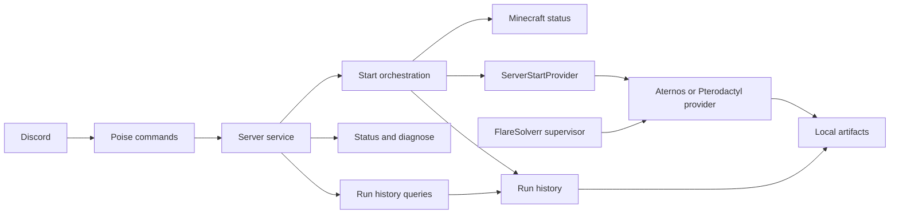

# Butler

[](https://github.com/germagla/butler_rs/actions/workflows/ci.yml)

A Rust-powered Discord operations bot for community infrastructure, game-server workflows, diagnostics, and future AI utilities.

The repository is named `butler_rs`, but the product identity is Butler. Butler can start one configured Minecraft server through either Play Hosting's Pterodactyl API or the browser-backed Aternos provider.

## Current Features

- `/server start` starts the configured server through the current provider adapter.
- `/server status` checks Minecraft reachability and typed status.
- `/server diagnose` reports local bot/server diagnostics.
- `/bot runs` lists recent completed start runs kept in memory.
- `/bot run` shows details for a specific run ID.
- `/bot last-error` shows the most recent failed run.
- Terminal diagnostics for local operation.
- Local screenshots, HTML captures, and JSONL event diagnostics with redaction and retention controls.

## Command Access

| Command | Access |
| --- | --- |
| `/server start` | Public |
| `/server status` | Public |
| `/server diagnose` | Bot owner or guild Administrator |
| `/bot runs` | Bot owner or guild Administrator |
| `/bot run` | Bot owner or guild Administrator |
| `/bot last-error` | Bot owner or guild Administrator |

Bot owners are configured with `BUTLER_OWNER_IDS`. In DMs, restricted commands are owner-only because there is no guild Administrator context. Owners can inspect all run history; guild Administrators can inspect raw run history only for runs from their current guild.

## Architecture



The active start lock is process-local and global, which is appropriate for the single configured server this version targets. Future multi-server support should key active runs by workspace, guild, or server ID.

`src/server_service/` is split into start orchestration, status/diagnose, run queries, run tracking/artifact retention, response formatting, and shared types.

## Local Setup

1. Install Rust.
2. For Aternos, install Chrome or Chromium. For Pterodactyl on macOS, install OrbStack and configure the isolated `flaresolverr` container described below.
3. Copy `.env.example` to `.env`.
4. Fill in Discord, provider, Minecraft, and owner settings.
5. Run the bot:

```bash
cargo run --release
```

For a live Minecraft status probe without Discord:

```bash
cargo run --bin status_debug -- your-server.example.com:25565
```

### Start Automatically On macOS

Install Butler as a per-user LaunchAgent so it starts after login and restarts if it exits:

```bash
./scripts/install-launch-agent.sh
```

The installer and Butler share a start-admission lock under the configured `ARTIFACT_DIR`.
The installer refuses to unload an already-running Butler process while a `/server start`
provider operation is active, and Butler rejects new starts while installation owns the lock.
Wait for an active run to finish, then run the installer again. A separate process lock prevents
two Butler instances from running against the same artifact directory. The LaunchAgent requests
up to 135 minutes for graceful shutdown, covering the maximum supported allocation and online
waits plus provider cleanup, though macOS may enforce a shorter system shutdown budget.

The installer builds the release binary, restricts `.env` to owner-only access, and runs the binary with the repository as its working directory. Re-run the installer after code changes to rebuild and restart the service.

Validate `.env` without connecting to Discord or starting local runtime services:

```bash
cargo run --release -- --check-config
```

Do not also run `cargo run --release` while the LaunchAgent is loaded, because that starts a second bot process. For an interactive run, unload the service first, then re-run the installer when finished:

```bash
launchctl bootout gui/$(id -u)/com.germagla.butler-rs
cargo run --release
```

Inspect the service and logs:

```bash
launchctl print gui/$(id -u)/com.germagla.butler-rs
tail -f artifacts/launchd/stdout.log artifacts/launchd/stderr.log
```

Remove automatic startup without deleting logs or run artifacts:

```bash
./scripts/uninstall-launch-agent.sh
```

## Configuration

| Variable | Purpose | Default |
| --- | --- | --- |
| `DISCORD_TOKEN` | Discord bot token. | Required |
| `SERVER_PROVIDER` | Active provider: `pterodactyl` or `aternos`. | Required |
| `MINECRAFT_SERVER_ADDR` | Minecraft address used by status, diagnose, and start preflight. | `localhost:25565` |
| `PTERODACTYL_PANEL_URL` | HTTPS panel origin. | Required for Pterodactyl |
| `PTERODACTYL_SERVER_ID` | Pterodactyl server identifier. | Required for Pterodactyl |
| `PTERODACTYL_API_TOKEN` | Pterodactyl client API token. | Required for Pterodactyl |
| `PTERODACTYL_POWER_ENABLED` | Allow the provider to issue the start power action. | `false` |
| `PTERODACTYL_ALLOCATION_WAIT_SECS` | Maximum wait for Play Hosting to allocate a sleeping server before reporting a safe-to-retry timeout. Valid range: 1-3600 seconds. | `1200` |
| `FLARESOLVERR_URL` | Loopback-only FlareSolverr endpoint. | `http://127.0.0.1:8191/` |
| `FLARESOLVERR_CONTAINER` | Existing isolated Docker container Butler supervises. | `flaresolverr` |
| `ORBSTACK_BIN` | Optional OrbStack CLI override. | `/opt/homebrew/bin/orbctl` |
| `DOCKER_BIN` | Optional Docker CLI override. | `/usr/local/bin/docker` |
| `ATERNOS_USER` / `ATERNOS_PASS` | Browser credentials. | Required for Aternos |
| `ATERNOS_SERVER_ID` | Optional Aternos server selector. | Empty |
| `HEADLESS` / `CHROME` | Aternos browser settings. | `true` / auto-detect |
| `START_WAIT_ONLINE_SECS` | Max wait when `/server start wait_online:true` is used. Valid range: 1-3600 seconds. | `600` |
| `RUN_HISTORY_LIMIT` | Completed runs retained in memory and newest artifact run directories retained locally. | `20` |
| `ARTIFACT_DIR` | Local diagnostics directory. | `artifacts/runs` |
| `ARTIFACT_CAPTURE` | Artifact capture policy: `screenshots`, `full`, `failure`, or `off`. | `screenshots` |
| `BUTLER_ATTACH_SCREENSHOTS` | Attach saved screenshots in Discord responses when available. Missing files fall back to text. | `true` |
| `BUTLER_OWNER_IDS` | Comma-separated Discord user IDs authorized for restricted commands. Invalid non-numeric IDs fail startup. | Empty |
| `BUTLER_PERSIST_RUN_EVENTS` | Write step-level JSONL diagnostics under `ARTIFACT_DIR`. | `true` |
| `BUTLER_REDACT_RUN_EVENTS` | Redact Discord IDs and names in persisted JSONL events. | `true` |
| `BUTLER_LOG` | Tracing/debug verbosity: `off`, `error`, `warn`, `info`, `debug`, `trace`. | `info` |
| `BUTLER_COLOR` | Enable colored terminal output unless `NO_COLOR` or `TERM=dumb` disables it. | `true` |

Invalid boolean, numeric, owner ID, artifact capture, log level, and color values fail startup instead of falling back silently.

### FlareSolverr Lifecycle

In Pterodactyl mode, Butler starts OrbStack when necessary, starts `flaresolverr`, verifies its loopback readiness endpoint, and keeps it healthy for Butler's process lifetime. A local ownership marker preserves this responsibility across Butler crashes and LaunchAgent restarts. On graceful shutdown Butler stops FlareSolverr only when it owns the container. Butler never stops OrbStack because that would interrupt unrelated containers.

The expected media-stack configuration keeps FlareSolverr behind its own Compose profile, uses restart policy `no`, pins the image by digest, binds host port `8191` only to `127.0.0.1`, and preserves the internal `http://flaresolverr:8191/` endpoint for Prowlarr. Butler validates these properties before starting the configured container and restarts it after a bounded readiness failure. Docker and OrbStack child processes receive a minimal environment without Butler or provider secrets. The API token is sent only by Butler to the exact configured HTTPS panel origin; FlareSolverr receives no API credentials.

For Play Hosting servers in limbo, Butler checks the host's sleep status and uses the wake endpoint with the full UUID only when allocation is not already active. It waits up to `PTERODACTYL_ALLOCATION_WAIT_SECS` for an active allocation, reports queue phase/position/estimate changes in an ordinary bot message that remains editable during long waits, then reads normal Pterodactyl resources and issues one `start` power action when the server is offline. Limbo takes precedence over the generic Pterodactyl suspended flag.

Wake/allocation and power-start uncertainty are tracked separately. A delayed allocation never triggers Minecraft submission verification because the power request has not happened yet. Each mutating request is issued at most once per command; ambiguous wake responses are checked through the read-only sleep-status endpoint, ambiguous power responses are checked through Pterodactyl resources, and only ambiguous power or browser-start submissions use Minecraft status as the service-level fallback. If the allocation deadline expires, running `/server start` again is safe: Butler inspects the current sleep status first and skips wake when the allocation is already `queued`, `waking`, or `active`.

Cloudflare clearance is kept in memory and requested from FlareSolverr with a 180-second challenge budget. A transient FlareSolverr availability failure is retried once before any provider mutation.

## Artifact Policy

Artifacts are local diagnostics only and are ignored by git. Screenshots are treated as operational diagnostics so the current browser/dashboard state is easy to inspect locally and, when available, in Discord responses.

`ARTIFACT_CAPTURE` controls local browser artifacts for Aternos:

| Value | Success capture | Failure capture |
| --- | --- | --- |
| `screenshots` | Screenshot | Screenshot and HTML |
| `full` | Screenshot and HTML | Screenshot and HTML |
| `failure` | None | Screenshot and HTML |
| `off` | None | None |

`events.jsonl` persists step-level run events by default. With `BUTLER_REDACT_RUN_EVENTS=true`, Discord user IDs, user names, guild/channel IDs, and guild/channel names are redacted. On startup, if redaction is enabled and an existing `events.jsonl` appears unredacted, Butler rotates it to `events.unredacted.backup.jsonl`; unreadable or corrupt event logs are quarantined to `events.corrupt.backup.jsonl` before new events are written.

When artifact capture or run-event persistence is enabled, Butler verifies on startup that `ARTIFACT_DIR` can be created, written, and cleaned up. Artifact writes during a run are diagnostic-only: if a screenshot, HTML, or marker file cannot be written, the command continues and logs a warning. Artifact run directories created by Butler are pruned by modification time on startup and after every completed run. Butler keeps the newest `RUN_HISTORY_LIMIT` run directories, skips unknown folders, and never prunes `events*.jsonl`.

Butler creates artifact directories with owner-only permissions (`0700`) and artifact/event files with owner-only permissions (`0600`) on Unix. Startup also repairs permissions on recognized existing Butler run directories and `events*.jsonl` files without touching unknown directories or symlinks.

Pterodactyl runs write a sanitized `provider_state.json` containing the current workflow stage, provider power state, suspension/limbo flags, the latest allocation phase/queue/connection fields, mutation flags, and the last transient error when applicable. They do not produce authenticated dashboard screenshots because FlareSolverr is used only to obtain Cloudflare clearance; the API token and Cloudflare cookies are never written to this artifact or injected into a browser session.

## Docker

Build the baseline image:

```bash
docker build -t butler_rs .
```

Run with a named artifact volume:

```bash
docker volume create butler_rs_artifacts
docker run --rm --env-file .env -e SERVER_PROVIDER=aternos -e ARTIFACT_DIR=/data/artifacts/runs -v butler_rs_artifacts:/data/artifacts/runs butler_rs
```

The Docker runtime supports the Aternos provider and uses Debian with Chromium installed. Pterodactyl mode is intentionally limited to local macOS operation because it manages OrbStack through local CLI tools; do not mount the host Docker socket into Butler. The explicit `-e ARTIFACT_DIR=/data/artifacts/runs` matters if your local `.env` uses `artifacts/runs`. If you bind-mount a host directory on Linux, make it writable by UID `10001`, for example `mkdir -p artifacts/runs && sudo chown -R 10001:10001 artifacts/runs`.

## Upgrading To v0.4

`SERVER_PROVIDER` is now required. Set it to `pterodactyl` for Play Hosting or `aternos` for rollback. The old Aternos `SERVER_ID` variable was renamed to `ATERNOS_SERVER_ID`; v0.4 still accepts the legacy name when the new one is absent, but new configurations should use `ATERNOS_SERVER_ID`. Pterodactyl mode also requires a writable `ARTIFACT_DIR` for the FlareSolverr ownership marker, even when browser artifact capture is disabled. LaunchAgent logs remain under `artifacts/launchd`; rotate or truncate them using normal local log maintenance when needed.

## Safety And Privacy

- Never commit `.env`.
- Runtime artifacts may contain Discord metadata, local paths, screenshots, authenticated Aternos page HTML, or sanitized provider state.
- Screenshots are kept available by default for operational diagnosis. Because `/server start` is public by design, enabled screenshot attachment may post authenticated dashboard screenshots to the Discord channel where the command is used.
- HTML is more sensitive, so the default only captures HTML on failure.
- Persisted JSONL events redact Discord names and IDs by default. Set `BUTLER_PERSIST_RUN_EVENTS=false` to disable persisted event logs.
- If runtime artifacts or secrets were ever pushed, clean future commits, prune history deliberately, and rotate affected secrets.

## Quality Gates

The CI workflow runs:

```bash
cargo fmt --all -- --check
cargo check --locked --all-targets --all-features
cargo test --locked --all-targets --all-features
cargo clippy --locked --all-targets --all-features -- -D warnings
docker build -t butler_rs:ci .
```

Local development should run the same gates before opening a pull request.

## License

MIT. See `LICENSE`.
