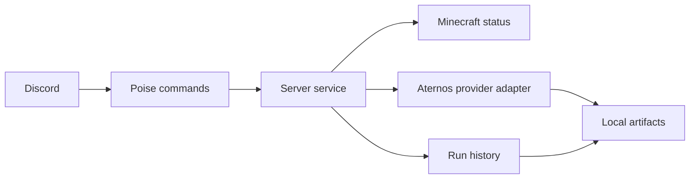

# Butler

[](https://github.com/germagla/butler_rs/actions/workflows/ci.yml)

A Rust-powered Discord operations bot for community infrastructure, game-server workflows, diagnostics, and future AI utilities.

The repository is currently named `butler_rs`, but the product identity is Butler. It is a Rust rewrite of an older Python Discord bot, built to improve reliability, type safety, async backend structure, and long-term maintainability. The first real integration is Minecraft server operations through an Aternos browser adapter, but the architecture is intended to grow as a provider-backed operations bot rather than an Aternos-only automation script.

## Current Features

- `/server start` starts the configured server through the current provider adapter.
- `/server status` checks Minecraft reachability and typed status.
- `/server diagnose` reports local bot/server diagnostics.
- `/bot runs` lists recent completed start runs kept in memory.
- `/bot run` shows details for a specific run ID.
- `/bot last-error` shows the most recent failed run.
- Temporary legacy aliases: `/aternos_start` and `/aternos_status`.
- Terminal diagnostics for local operation.
- Ignored local artifacts for screenshots, HTML captures, and JSONL event diagnostics.

## Architecture



The active start lock is currently process-local and global, which is appropriate for the single configured server this version targets. Future multi-server support should key active runs by workspace, guild, or server ID.

`src/server_service.rs` still carries start orchestration, status, run queries, run tracking, and formatting. A later cleanup can split it into smaller service modules after the current behavior is covered by tests.

## Tech Stack

- Rust 2024
- Tokio
- Serenity and Poise
- `headless_chrome`
- `craftping`
- `tracing`

## Local Setup

1. Install Rust.
2. Copy `.env.example` to `.env`.
3. Fill in Discord, provider, and Minecraft settings.
4. Run the bot:

```bash
cargo run
```

For a live Minecraft status probe without Discord:

```bash
cargo run --bin status_debug -- your-server.example.com:25565
```

## Configuration

| Variable | Purpose | Default |
| --- | --- | --- |
| `DISCORD_TOKEN` | Discord bot token. | Required |
| `ATERNOS_USER` | Username for the current Aternos browser adapter. | Required |
| `ATERNOS_PASS` | Password for the current Aternos browser adapter. | Required |
| `MINECRAFT_SERVER_ADDR` | Minecraft address used by status, diagnose, and start preflight. | `localhost:25565` |
| `SERVER_ID` | Optional provider-specific server selector. | Empty |
| `HEADLESS` | Run browser automation headlessly. | `true` |
| `START_WAIT_ONLINE_SECS` | Max wait when `/server start wait_online:true` is used. | `600` |
| `RUN_HISTORY_LIMIT` | Number of completed runs retained in memory. | `20` |
| `ARTIFACT_DIR` | Local diagnostics directory. | `artifacts/runs` |
| `BUTLER_PERSIST_RUN_EVENTS` | Write step-level JSONL diagnostics under `ARTIFACT_DIR`. | `true` |
| `BUTLER_REDACT_RUN_EVENTS` | Redact Discord IDs and names in persisted JSONL events. | `true` |
| `BUTLER_LOG` | Tracing/debug verbosity: `off`, `error`, `warn`, `info`, `debug`, `trace`. | `info` |
| `BUTLER_COLOR` | Enable colored terminal output unless `NO_COLOR` or `TERM=dumb` disables it. | `true` |

## Safety And Privacy

- Never commit `.env`.
- Runtime artifacts may contain Discord IDs, usernames, guild/channel names, local paths, screenshots, and authenticated page HTML.
- Artifacts are local diagnostics only and are ignored by git.
- Persisted JSONL events redact Discord names and IDs by default. Set `BUTLER_PERSIST_RUN_EVENTS=false` to disable persisted event logs.
- If runtime artifacts or secrets were ever pushed, clean future commits and rotate affected secrets. Do not rewrite shared history automatically without coordinating it.

## Quality Gates

The CI workflow runs:

```bash
cargo fmt --all -- --check
cargo check --locked --all-targets --all-features
cargo test --locked --all-targets --all-features
cargo clippy --locked --all-targets --all-features -- -D warnings
```

Local development should run the same gates before opening a pull request.

## Roadmap

- Provider abstraction beyond the current browser-backed Aternos adapter.
- Better persistence and retention for run history.
- Permission model for diagnostics and run artifact access.
- Docker deployment.
- AI utilities once the Rust backend foundation is stable.
- TypeScript dashboard for operations visibility.

## History Cleanup Note

This change removes runtime artifacts from the working tree and prevents future commits from tracking them. If sensitive artifacts were already pushed, use a coordinated history cleanup tool such as `git filter-repo` or BFG, then force-push only after confirming that collaborators and deployments are ready. Rotate any affected tokens or passwords.
