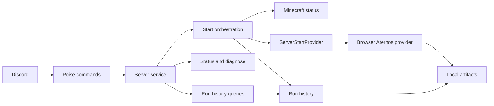

# Butler

[](https://github.com/germagla/butler_rs/actions/workflows/ci.yml)

A Rust-powered Discord operations bot for community infrastructure, game-server workflows, diagnostics, and future AI utilities.

The repository is named `butler_rs`, but the product identity is Butler. The current server integration is a browser-backed Aternos provider for Minecraft operations. The service layer uses provider-neutral start result and failure types so future providers can be added without changing command handling.

## Current Features

- `/server start` starts the configured server through the current provider adapter.
- `/server status` checks Minecraft reachability and typed status.
- `/server diagnose` reports local bot/server diagnostics.
- `/bot runs` lists recent completed start runs kept in memory.
- `/bot run` shows details for a specific run ID.
- `/bot last-error` shows the most recent failed run.
- Temporary legacy aliases: `/aternos_start` and `/aternos_status`.
- Terminal diagnostics for local operation.
- Local screenshots, HTML captures, and JSONL event diagnostics with redaction and retention controls.

## Command Access

| Command | Access |
| --- | --- |
| `/server start` | Public |
| `/server status` | Public |
| `/aternos_start` | Public deprecated alias |
| `/aternos_status` | Public deprecated alias |
| `/server diagnose` | Bot owner or guild Administrator |
| `/bot runs` | Bot owner or guild Administrator |
| `/bot run` | Bot owner or guild Administrator |
| `/bot last-error` | Bot owner or guild Administrator |

Bot owners are configured with `BUTLER_OWNER_IDS`. In DMs, restricted commands are owner-only because there is no guild Administrator context. Owners can inspect all run history; guild Administrators can inspect raw run history only for runs from their current guild.

## Architecture



The active start lock is process-local and global, which is appropriate for the single configured server this version targets. Future multi-server support should key active runs by workspace, guild, or server ID.

`src/server_service/` is split into start orchestration, status/diagnose, run queries, run tracking/artifact retention, response formatting, and shared types.

## Local Setup

1. Install Rust.
2. Install Chrome or Chromium for `/server start`; set `CHROME=/path/to/chrome-or-chromium` in `.env` if it is not auto-detected.
3. Copy `.env.example` to `.env`.
4. Fill in Discord, provider, Minecraft, and owner settings.
5. Run the bot:

```bash
cargo run --release
```

For a live Minecraft status probe without Discord:

```bash
cargo run --bin status_debug -- your-server.example.com:25565
```

### Start Automatically On macOS

Install Butler as a per-user LaunchAgent so it starts after login and restarts if it exits:

```bash
./scripts/install-launch-agent.sh
```

The installer builds the release binary, restricts `.env` to owner-only access, and runs the binary with the repository as its working directory. Re-run the installer after code changes to rebuild and restart the service.

Do not also run `cargo run --release` while the LaunchAgent is loaded, because that starts a second bot process. For an interactive run, unload the service first, then re-run the installer when finished:

```bash
launchctl bootout gui/$(id -u)/com.germagla.butler-rs
cargo run --release
```

Inspect the service and logs:

```bash
launchctl print gui/$(id -u)/com.germagla.butler-rs
tail -f artifacts/launchd/stdout.log artifacts/launchd/stderr.log
```

Remove automatic startup without deleting logs or run artifacts:

```bash
./scripts/uninstall-launch-agent.sh
```

## Configuration

| Variable | Purpose | Default |
| --- | --- | --- |
| `DISCORD_TOKEN` | Discord bot token. | Required |
| `ATERNOS_USER` | Username for the current Aternos browser adapter. | Required |
| `ATERNOS_PASS` | Password for the current Aternos browser adapter. | Required |
| `MINECRAFT_SERVER_ADDR` | Minecraft address used by status, diagnose, and start preflight. | `localhost:25565` |
| `SERVER_ID` | Optional provider-specific server selector. | Empty |
| `HEADLESS` | Run browser automation headlessly. | `true` |
| `START_WAIT_ONLINE_SECS` | Max wait when `/server start wait_online:true` is used. | `600` |
| `RUN_HISTORY_LIMIT` | Completed runs retained in memory and newest artifact run directories retained locally. | `20` |
| `ARTIFACT_DIR` | Local diagnostics directory. | `artifacts/runs` |
| `ARTIFACT_CAPTURE` | Artifact capture policy: `screenshots`, `full`, `failure`, or `off`. | `screenshots` |
| `BUTLER_ATTACH_SCREENSHOTS` | Attach saved screenshots in Discord responses when available. Missing files fall back to text. | `true` |
| `BUTLER_OWNER_IDS` | Comma-separated Discord user IDs authorized for restricted commands. Invalid non-numeric IDs fail startup. | Empty |
| `BUTLER_PERSIST_RUN_EVENTS` | Write step-level JSONL diagnostics under `ARTIFACT_DIR`. | `true` |
| `BUTLER_REDACT_RUN_EVENTS` | Redact Discord IDs and names in persisted JSONL events. | `true` |
| `BUTLER_LOG` | Tracing/debug verbosity: `off`, `error`, `warn`, `info`, `debug`, `trace`. | `info` |
| `BUTLER_COLOR` | Enable colored terminal output unless `NO_COLOR` or `TERM=dumb` disables it. | `true` |

Invalid boolean, numeric, owner ID, artifact capture, log level, and color values fail startup instead of falling back silently.

## Artifact Policy

Artifacts are local diagnostics only and are ignored by git. Screenshots are treated as operational diagnostics so the current browser/dashboard state is easy to inspect locally and, when available, in Discord responses.

`ARTIFACT_CAPTURE` controls local browser artifacts:

| Value | Success capture | Failure capture |
| --- | --- | --- |
| `screenshots` | Screenshot | Screenshot and HTML |
| `full` | Screenshot and HTML | Screenshot and HTML |
| `failure` | None | Screenshot and HTML |
| `off` | None | None |

`events.jsonl` persists step-level run events by default. With `BUTLER_REDACT_RUN_EVENTS=true`, Discord user IDs, user names, guild/channel IDs, and guild/channel names are redacted. On startup, if redaction is enabled and an existing `events.jsonl` appears unredacted, Butler rotates it to `events.unredacted.backup.jsonl`; unreadable or corrupt event logs are quarantined to `events.corrupt.backup.jsonl` before new events are written.

When artifact capture or run-event persistence is enabled, Butler verifies on startup that `ARTIFACT_DIR` can be created, written, and cleaned up. Artifact writes during a run are diagnostic-only: if a screenshot, HTML, or marker file cannot be written, the command continues and logs a warning. Artifact run directories created by Butler are pruned by modification time on startup and after every completed run. Butler keeps the newest `RUN_HISTORY_LIMIT` run directories, skips unknown folders, and never prunes `events*.jsonl`.

## Docker

Build the baseline image:

```bash
docker build -t butler_rs .
```

Run with a named artifact volume:

```bash
docker volume create butler_rs_artifacts
docker run --rm --env-file .env -e ARTIFACT_DIR=/data/artifacts/runs -v butler_rs_artifacts:/data/artifacts/runs butler_rs
```

The Docker runtime uses Debian with Chromium installed, sets `HEADLESS=true`, sets `CHROME=/usr/bin/chromium`, and documents `/data/artifacts/runs` as the container artifact directory. The explicit `-e ARTIFACT_DIR=/data/artifacts/runs` matters if your local `.env` was copied from `.env.example`, because that file uses `artifacts/runs` for non-container development. If you bind-mount a host directory on Linux, make it writable by UID `10001`, for example `mkdir -p artifacts/runs && sudo chown -R 10001:10001 artifacts/runs`.

## Safety And Privacy

- Never commit `.env`.
- Runtime artifacts may contain Discord metadata, local paths, screenshots, and authenticated page HTML.
- Screenshots are kept available by default for operational diagnosis. Because `/server start` is public by design, enabled screenshot attachment may post authenticated dashboard screenshots to the Discord channel where the command is used.
- HTML is more sensitive, so the default only captures HTML on failure.
- Persisted JSONL events redact Discord names and IDs by default. Set `BUTLER_PERSIST_RUN_EVENTS=false` to disable persisted event logs.
- If runtime artifacts or secrets were ever pushed, clean future commits, prune history deliberately, and rotate affected secrets.

## Quality Gates

The CI workflow runs:

```bash
cargo fmt --all -- --check
cargo check --locked --all-targets --all-features
cargo test --locked --all-targets --all-features
cargo clippy --locked --all-targets --all-features -- -D warnings
docker build -t butler_rs:ci .
```

Local development should run the same gates before opening a pull request.

## License

MIT. See `LICENSE`.
